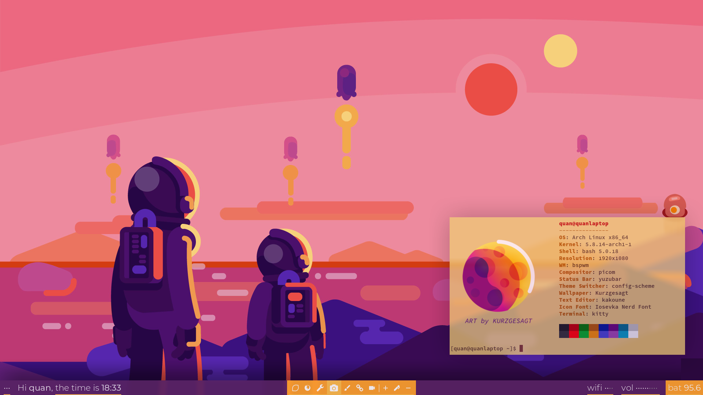
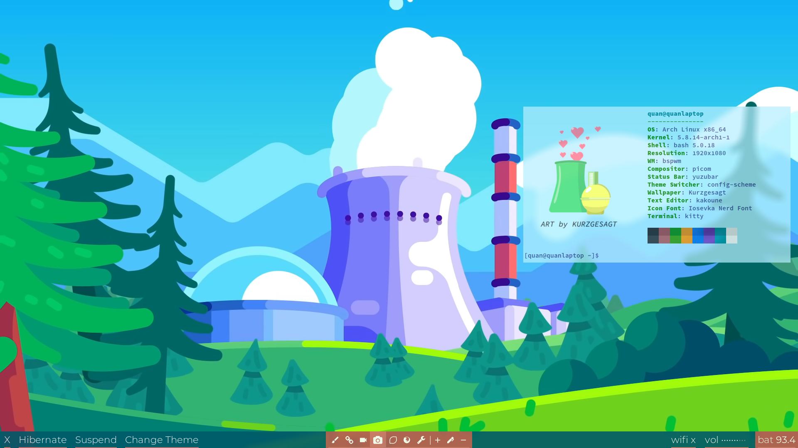

# Yuzubar - the YAML-based status bar

<p align="center">
  
  
</p>


## Dependencies
Yuzubar currently depends on Lemonbar and [Linkt](https://github.com/quandangv/linkt); I'm working to merge Lemonbar into Yambar itself.
1. **Lemonbar** - It's recommended to install the xft-supported version of lemonbar.
```
git clone https://gitlab.com/protesilaos/lemonbar-xft
cd lemonbar-xft
make
make install
```
2. **Linkt** - Developed by myself :), it contains most of the core functionalities.
```
git clone https://github.com/quandangv/linkt
cd linked_nodes
./build.sh -A
```

## Install
After installing the dependencies, execute these command to install yuzubar:
```
make
make install
```

## Examples
To launch an example bar, simply run `make full`. To launch a simple, easy-to-understand bar, run `make simple`. The commands used to start the bar in these examples will be printed out by _make_.

## Usage
Instructions for the command-line tool can be found in the [command-line-help](command-line-help.txt.in).
For instructions on the syntax of .yzb files, refer to the [Linkt repo](https://github.com/quandangv/linkt)
